# Innova Infrastructure as Code

## Overview

This is a comprehensive Terraform Infrastructure as Code (IaC) project for deploying scalable application infrastructure on Google Cloud Platform. The infrastructure supports secure, cost-optimized environments with VPN-based administration and follows a documentation-first development approach.

**Key Features**: Secure VPN-only access, automated deployment, production-ready architecture, comprehensive monitoring, and cost optimization.

## 🏗️ Architecture Overview

This project provides a complete IaC solution for deploying application infrastructure with **secure VPN-only access** and two distinct environments:

### Staging Environment
- **Single VM deployment** (e2-standard-2: 2 vCPUs, 8 GB RAM)
- Combined application and database instance
- Cost-optimized for development and testing
- Basic resource allocation

### Production Environment  
- **Dual VM architecture** optimized for performance
- **Application Server**: n2-standard-4 (4 vCPUs, 16 GB RAM)
- **Database Server**: n2-highmem-4 (4 vCPUs, 32 GB RAM)
- Separate database instance for better resource isolation
- NGINX reverse proxy with SSL/TLS support
- Redis cache on application server

### Security Architecture
- **OpenVPN Server**: e2-micro instance for secure admin access
- **Zero External Access**: SSH and database access only via VPN
- **5 VPN Users Maximum**: Cost-optimized for small teams
- **Public Access**: Only HTTPS (443) and HTTP (80) for application interface

## 🌐 Network Architecture

```mermaid
graph TB
    subgraph Internet["🌐 Internet"]
        USER[👤 Users]
        DEV[👨‍💻 Developers]
    end
    
    subgraph GCP["☁️ Google Cloud Platform"]
        subgraph VPC["🏠 VPC staging-vpc (10.0.0.0/24)"]
            
            subgraph VPN_ZONE["🔒 VPN Security Zone"]
                VPN_SERVER["🔐 VPN Server<br/>vpn-staging<br/>10.0.0.2<br/>e2-micro"]
            end
            
            subgraph APP_ZONE["🚀 Application Zone"]
                APP_SERVER["🖥️ App Server<br/>app-staging<br/>10.0.0.3<br/>e2-standard-2"]
            end
            
            subgraph CICD_ZONE["⚙️ CI/CD Zone"]
                JENKINS["🔧 Jenkins Server<br/>jenkins-staging<br/>10.0.0.4<br/>e2-small"]
            end
        end
        
        subgraph SERVICES["☁️ GCP Services"]
            GCS["📦 Cloud Storage"]
            MONITORING["📊 Monitoring"]
            IAM["🔑 IAM"]
        end
    end
    
    USER --> APP_SERVER
    DEV --> VPN_SERVER
    VPN_SERVER -.-> APP_SERVER
    VPN_SERVER -.-> JENKINS
    APP_SERVER --> GCS
    JENKINS -.-> APP_SERVER
```



## 🛠️ Current Infrastructure Status

### Staging Environment (Deployed)

| Component | Instance | Internal IP | External IP | Status | Purpose |
|-----------|----------|-------------|-------------|--------|---------|
| **VPN Server** | vpn-staging | 10.0.0.2 | Public | ✅ Running | OpenVPN access point |
| **App Server** | app-staging | 10.0.0.3 | Public | ✅ Running | Odoo, PostgreSQL, Redis, NGINX |
| **Jenkins** | jenkins-staging | 10.0.0.4 | Public | ✅ Running | CI/CD, Mailhog, pgAdmin |

### Services and Ports

| Service | Port | Access | Description |
|---------|------|--------|-------------|
| **Web Application** | 80, 443 | Public | Main application (HTTPS redirects) |
| **OpenVPN** | 1194 | Public | VPN server access |
| **SSH** | 22 | VPN Only | Server administration |
| **PostgreSQL** | 5432 | Internal | Database access |
| **Redis** | 6379 | Internal | Cache and sessions |
| **Jenkins** | 8080 | VPN Only | CI/CD web interface |
| **Mailhog** | 8025 | VPN Only | Email testing |
| **pgAdmin** | 5050 | VPN Only | Database management |

## 🚀 Quick Start

### Prerequisites

1. **GCP Account** with billing enabled
2. **Terraform >= 1.5.0** installed
3. **gcloud CLI** installed and authenticated
4. **Required GCP APIs** enabled:
   - Compute Engine API
   - IAM Service Account API  
   - Cloud Monitoring API
   - Cloud Logging API
   - Cloud KMS API (for production encryption)
   - Identity-Aware Proxy API

### Installation

```bash
# Clone the repository
git clone https://github.com/linarez-software/innova-infrastructure-iac.git
cd innova-infrastructure-iac

# Create GCS bucket for Terraform state
gsutil mb gs://YOUR-PROJECT-ID-terraform-state

# Configure staging environment
cd environments/staging
cp terraform.tfvars.example terraform.tfvars
# Edit terraform.tfvars with your configuration

# Initialize and deploy staging
terraform init
terraform plan
terraform apply

# Configure production environment  
cd ../production
cp terraform.tfvars.example terraform.tfvars
# Edit terraform.tfvars with your production configuration

# Initialize and deploy production
terraform init
terraform plan  
terraform apply
```

## 📊 Instance Specifications

| Environment | Component | Instance Type | vCPUs | RAM | Storage | Purpose |
|-------------|-----------|---------------|-------|-----|---------|----------|
| **Staging** | All-in-one | e2-standard-2 | 2 | 8 GB | 20 GB SSD | Development |
| **Production** | App Server | n2-standard-4 | 4 | 16 GB | 30 GB SSD | Application |
| **Production** | Database | n2-highmem-4 | 4 | 32 GB | 100 GB SSD | PostgreSQL |
| **Both** | VPN Server | e2-micro | 1 | 1 GB | 10 GB Standard | 5 VPN users |

## ⚡ Performance Optimization

### PostgreSQL Configuration (Production)
```conf
shared_buffers = 8GB          # 25% of 32GB RAM
effective_cache_size = 24GB   # 75% of 32GB RAM
work_mem = 256MB              # Complex queries
maintenance_work_mem = 2GB    # Maintenance ops
max_connections = 100         # With connection pooling
```

### NGINX Configuration
- **HTTP/2** enabled for modern performance
- **Connection pooling** for application backends
- **Static file caching** (1 year expiry)
- **Gzip compression** for text assets
- **Rate limiting** on sensitive endpoints
- **SSL/TLS** with Let's Encrypt

## 🔧 Configuration

### Required Variables

#### Staging (`environments/staging/terraform.tfvars`)
```hcl
project_id = "your-gcp-project-id"
region     = "us-central1"  
zone       = "us-central1-a"
db_password = "your-db-password"
```

#### Production (`environments/production/terraform.tfvars`)  
```hcl
project_id                    = "your-gcp-project-id"
production_app_instance_type  = "n2-standard-4"     # 4 vCPUs, 16 GB RAM
production_db_instance_type   = "n2-highmem-4"      # 4 vCPUs, 32 GB RAM
domain_name                   = ""                   # Optional - leave empty for IP-only access
ssl_email                     = "admin@example.com"  # For monitoring alerts
allowed_ssh_ips              = ["203.0.113.0/24"]   # Your office/VPN IP range
db_password                  = "strong-db-password"
enable_monitoring            = true                  # Cloud Monitoring dashboards
enable_backups              = true                  # Automated daily backups
backup_retention_days       = 30                    # Keep backups for 30 days
```

## 🔐 Security Features

### Network Security
- **VPC with custom subnets** and firewall rules
- **VPN-only SSH access** (10.8.0.0/24 subnet)
- **Zero Trust Architecture**: No external admin access except via VPN
- **Internal-only** database communication (port 5432)
- **SSL/TLS encryption** with Let's Encrypt
- **OpenVPN server** with certificate-based authentication

### Firewall Rules (Staging)

| Rule | Ports | Source | Target | Purpose |
|------|-------|--------|--------|---------|
| `staging-allow-http-https` | 80, 443 | 0.0.0.0/0 | web-server | Public web access |
| `staging-allow-vpn-server` | 1194 | 0.0.0.0/0 | vpn-server | VPN connections |
| `staging-allow-ssh-vpn-only` | 22 | 10.8.0.0/24 | ssh-server | SSH via VPN only |
| `staging-allow-jenkins-web` | 8080 | 10.8.0.0/24 | jenkins-server | Jenkins UI |
| `staging-allow-dev-tools` | 8025, 5050 | 10.8.0.0/24 | dev-tools | Development tools |
| `staging-allow-internal` | All | 10.0.0.0/24 | All | Internal communication |
| `staging-allow-vpn-clients` | All | 10.8.0.0/24 | All | VPN client access |

### Access Control
- **Service accounts** with least-privilege IAM roles
- **Project-level SSH keys**: Centralized SSH key management via GCP metadata
- **Certificate-based VPN**: PKI infrastructure with Easy-RSA
- **OS Login** for SSH key management

### Data Protection  
- **Automated backups** with 30-day retention
- **WAL archiving** for PostgreSQL
- **Snapshot policies** for persistent disks
- **GCS backup storage** with lifecycle management

## 📈 Monitoring & Alerting

### Cloud Monitoring Dashboards
- **VM metrics** (CPU, memory, disk, network)
- **PostgreSQL performance** on dedicated instance
- **Application metrics**
- **Local SSD performance** tracking

### Alert Policies
- **High CPU usage** (>80% for 5 minutes)
- **High memory usage** (>90% for 5 minutes)  
- **Disk space usage** (>85%)
- **Instance downtime** detection
- **Database connection failures**
- **Local SSD performance degradation**

## 📋 Post-Deployment Information

After successful deployment, Terraform will output:

### Staging Outputs
```
app_instance_ip = "X.X.X.X"
app_instance_name = "app-staging"
vpn_server_ip = "Y.Y.Y.Y"
vpn_config_bucket = "PROJECT_ID-staging-vpn-configs"
```

### Production Outputs
```
app_instance_ip = "X.X.X.X"
app_instance_name = "app-production"
db_instance_ip = "Z.Z.Z.Z"
db_instance_name = "db-production"
vpn_server_ip = "Y.Y.Y.Y"
vpn_config_bucket = "PROJECT_ID-production-vpn-configs"
```

## ⚠️ Important Notes

### Security Considerations
- **Change default passwords** immediately after deployment
- **VPN is mandatory** for all administrative access
- **No direct SSH** from public internet (blocked by firewall)
- **Database passwords** are stored in terraform.tfvars - keep secure
- **SSL certificates** require valid domain for production

### Operational Notes
- **VPN setup completes** ~2-3 minutes after instance creation
- **First VPN user** is "admin" - config auto-uploaded to GCS
- **PostgreSQL** runs on port 5432 (internal only)
- **Redis** runs on port 6379 (internal only) 
- **Monitoring alerts** sent to configured email address

### Limitations
- Maximum **5 concurrent VPN users** (e2-micro optimization)
- **Staging** uses single VM (app + database combined)
- **No auto-scaling** configured (manual scaling only)

## 💰 Cost Estimation

### Monthly Cost Estimates (us-central1)

| Environment | Instance Cost | Storage Cost | Network Cost | VPN Cost | Total Est. |
|-------------|---------------|--------------|--------------|----------|------------|
| **Staging** | ~$50 | ~$5 | ~$5 | ~$9 | **~$69/month** |
| **Production** | ~$180 | ~$25 | ~$10 | ~$9 | **~$224/month** |

*Estimates include VPN server (e2-micro) and static IP. Actual costs may vary based on usage patterns.*

## 📚 Documentation

- **[DEPLOYMENT.md](docs/DEPLOYMENT.md)** - Detailed deployment guide
- **[VPN-ACCESS.md](docs/VPN-ACCESS.md)** - VPN setup and user management
- **[STORAGE.md](docs/STORAGE.md)** - Storage configuration and optimization
- **[SECURITY.md](docs/SECURITY.md)** - Security best practices  
- **[MONITORING.md](docs/MONITORING.md)** - Monitoring setup
- **[BACKUP.md](docs/BACKUP.md)** - Backup and disaster recovery
- **[PERFORMANCE.md](docs/PERFORMANCE.md)** - Performance tuning guide

## 🔍 Useful Commands

## 🔐 VPN Management & SSH Access

### Enhanced VPN User Creation
```bash
# Complete VPN user setup with SSH key management (recommended)
./scripts/create-vpn-user.sh USERNAME [SSH_PUBLIC_KEY_PATH]
./scripts/create-vpn-user.sh john ~/.ssh/id_rsa.pub

# Deploy SSH keys to all servers at once
./scripts/deploy-ssh-key-to-all.sh USERNAME [SSH_KEY_PATH]

# Alternative: Generate VPN configuration only
./scripts/generate-vpn-client.sh PROJECT_ID ZONE USERNAME
```

### VPN Server Management
```bash
# Add VPN user with SSH access
gcloud compute ssh vpn-staging --zone=us-central1-a \
  --command="sudo /opt/scripts/manage-vpn-users.sh add john"

# Add SSH key to existing VPN user
gcloud compute ssh vpn-staging --zone=us-central1-a \
  --command="sudo /opt/scripts/manage-vpn-users.sh add-ssh-key john 'ssh-rsa AAAAB...'"

# List all users and their access status
gcloud compute ssh vpn-staging --zone=us-central1-a \
  --command="sudo /opt/scripts/manage-vpn-users.sh list-users"

# Revoke VPN and SSH access
gcloud compute ssh vpn-staging --zone=us-central1-a \
  --command="sudo /opt/scripts/manage-vpn-users.sh revoke john"

# Monitor VPN status and connections
gcloud compute ssh vpn-staging --zone=us-central1-a \
  --command="sudo /opt/scripts/vpn-monitor.sh"
```

### SSH Access
```bash
# Direct SSH to VPN server (public access)
gcloud compute ssh vpn-staging --zone=us-central1-a

# SSH to internal servers (requires VPN connection first)
ssh username@10.0.0.3  # App server
ssh username@10.0.0.4  # Jenkins server

# Alternative using gcloud (requires VPN connection for internal IPs)
gcloud compute ssh app-staging --zone=us-central1-a --internal-ip
gcloud compute ssh jenkins-staging --zone=us-central1-a --internal-ip
```

### SSH Key Management
```bash
# Add SSH key to project metadata (affects all servers)
gcloud compute project-info add-metadata --metadata-from-file ssh-keys=~/.ssh/id_rsa.pub

# Test SSH access to all servers
./environments/staging/test-ssh-access.sh

# Troubleshoot SSH access issues
# 1. Ensure VPN is connected
# 2. Check SSH agent has key loaded: ssh-add -l
# 3. Try with explicit key: ssh -i ~/.ssh/id_rsa username@10.0.0.3
# 4. Check verbose output: ssh -vv username@10.0.0.3
```

### Application Management
```bash
# View application logs
sudo journalctl -u nginx -f
sudo tail -f /var/log/nginx/access.log
sudo tail -f /var/log/nginx/error.log

# Restart services
sudo systemctl restart nginx
sudo systemctl restart postgresql
sudo systemctl restart redis-server

# Check service status
sudo systemctl status nginx
sudo systemctl status postgresql
sudo systemctl status redis-server
```

### Database Operations
```bash
# Connect to PostgreSQL
sudo -u postgres psql

# Monitor active connections
sudo -u postgres psql -c "SELECT * FROM pg_stat_activity;"

# Check database size
sudo -u postgres psql -c "SELECT pg_database.datname, pg_size_pretty(pg_database_size(pg_database.datname)) AS size FROM pg_database;"

# Run manual backup
sudo -u postgres pg_dump app_db > /backup/manual_backup_$(date +%Y%m%d).sql
```

### Monitoring & Troubleshooting
```bash
# Check system resources
htop
df -h
free -h

# Monitor network connections
sudo netstat -tulpn
sudo ss -tulpn

# Check firewall rules
sudo iptables -L -n -v

# View system logs
sudo journalctl -xe
sudo dmesg -T
```

## 🎯 Key Features

✅ **Production-ready** architecture with dual VM setup  
✅ **Performance optimized** infrastructure  
✅ **Cost-effective** staging environment  
✅ **Secure VPN access** with OpenVPN server (5 users)
✅ **Zero external admin access** except application web interface
✅ **Automated SSL** with Let's Encrypt  
✅ **High-performance storage** optimized for application workloads  
✅ **Connection pooling** with PgBouncer  
✅ **Comprehensive monitoring** and alerting  
✅ **Automated backups** with retention policies  
✅ **Infrastructure as Code** with Terraform modules  

## 🏗️ Project Structure

The infrastructure is organized into reusable Terraform modules and management scripts:

```
├── modules/
│   ├── networking/          # VPC, subnets, firewall rules
│   ├── compute/            # VM instances and configurations  
│   ├── security/           # IAM, service accounts, encryption
│   ├── vpn/               # OpenVPN server setup
│   ├── database/          # PostgreSQL configurations
│   └── monitoring/        # Cloud Monitoring setup
├── environments/
│   ├── staging/           # Staging environment config
│   └── production/        # Production environment config
├── scripts/               # Management and deployment scripts
│   ├── create-vpn-user.sh       # Complete VPN user setup with SSH
│   ├── deploy-ssh-key-to-all.sh # Deploy SSH keys to all servers
│   └── generate-vpn-client.sh   # Generate VPN configurations
└── docs/                 # Architecture and documentation
```

## 🔧 Management Scripts

### Key Scripts
- **`scripts/create-vpn-user.sh`**: Complete VPN user setup with SSH keys
- **`scripts/deploy-ssh-key-to-all.sh`**: Deploy SSH keys to all servers
- **`scripts/generate-vpn-client.sh`**: Generate VPN configurations  
- **`environments/staging/test-ssh-access.sh`**: Test SSH connectivity
- **`environments/staging/update-vpn-management.sh`**: Update VPN server scripts

### Server Management (on VPN server)
```bash
# Enhanced user management with SSH integration
sudo /opt/scripts/manage-vpn-users.sh {add|add-ssh-key|revoke|list|list-users|status}

# VPN monitoring and troubleshooting
sudo /opt/scripts/vpn-monitor.sh

# Generate client configurations
sudo /opt/scripts/generate-client-config.sh USERNAME

# Verify VPN installation
sudo /opt/scripts/verify-vpn.sh
```

Each module is independent and can be customized for specific requirements.

## 🔧 Troubleshooting

### Common Issues and Solutions

#### VPN Connection Issues
```bash
# Check VPN server status
gcloud compute instances describe vpn-production --zone=us-central1-a

# View VPN server logs
gcloud compute instances get-serial-port-output vpn-production --zone=us-central1-a

# Restart VPN server
gcloud compute instances stop vpn-production --zone=us-central1-a
gcloud compute instances start vpn-production --zone=us-central1-a
```

#### SSH Access Issues  
```bash
# Run comprehensive SSH diagnosis
./environments/staging/test-ssh-access.sh

# Check SSH key deployment
gcloud compute ssh SERVER --zone=us-central1-a --internal-ip \
  --command="sudo ssh-keygen -l -f /home/USERNAME/.ssh/authorized_keys"

# Fix SSH key on specific server
gcloud compute ssh SERVER --zone=us-central1-a --internal-ip \
  --command="echo 'ssh-rsa YOUR_PUBLIC_KEY' | sudo tee /home/USERNAME/.ssh/authorized_keys"

# Verify firewall rules allow VPN SSH access  
gcloud compute firewall-rules list --filter="name:staging-allow-ssh-vpn-only"

# Common SSH troubleshooting steps:
# 1. Ensure VPN is connected: ping 10.0.0.3
# 2. Check SSH key fingerprint matches
# 3. Try verbose SSH: ssh -vv username@10.0.0.3
# 4. Check SSH agent: ssh-add -l
```

#### VPN User Management Issues
```bash
# Update VPN server management scripts
./environments/staging/update-vpn-management.sh

# Check VPN server script functionality
gcloud compute ssh vpn-staging --zone=us-central1-a \
  --command="sudo /opt/scripts/manage-vpn-users.sh list-users"

# Regenerate VPN client configuration
gcloud compute ssh vpn-staging --zone=us-central1-a \
  --command="sudo /opt/scripts/generate-client-config.sh USERNAME"
```

#### Terraform State Issues
```bash
# Refresh state
terraform refresh

# Import existing resources
terraform import module.MODULE_NAME.RESOURCE_TYPE.RESOURCE_NAME RESOURCE_ID

# Force unlock state
terraform force-unlock LOCK_ID
```

#### Application Not Accessible
```bash
# Check NGINX status
sudo systemctl status nginx

# Check firewall allows HTTP/HTTPS
gcloud compute firewall-rules list --filter="name:allow-http"

# Verify static IP is attached
gcloud compute addresses list
```

## 🔄 Development Workflow

### 1. Documentation-First Approach  
This project follows a documentation-first methodology:
1. **Document** architecture and requirements
2. **Create** network diagrams and specifications
3. **Review** and validate design
4. **Implement** in staging environment
5. **Test** and validate functionality
6. **Deploy** to production when ready

### 2. Infrastructure Changes
```bash
# Make changes to Terraform configurations
# Always test in staging first
cd environments/staging
terraform plan
terraform apply

# Validate functionality works as expected
# Test VPN access, SSH connectivity, applications

# Deploy to production when ready
cd ../production
terraform plan  
terraform apply
```

### 3. VPN User Lifecycle
```bash
# Add new team member
./scripts/create-vpn-user.sh newuser ~/.ssh/keys/newuser.pub

# Manage existing users  
gcloud compute ssh vpn-staging --zone=us-central1-a \
  --command="sudo /opt/scripts/manage-vpn-users.sh list-users"

# Remove access when needed
gcloud compute ssh vpn-staging --zone=us-central1-a \
  --command="sudo /opt/scripts/manage-vpn-users.sh revoke olduser"
```

### 4. Security Best Practices
- **VPN Required**: All administrative access requires VPN connection
- **SSH Keys**: Use strong SSH keys (RSA 4096-bit recommended)
- **Firewall Rules**: Never expose internal services directly to internet
- **Regular Updates**: Keep system packages and services updated
- **Documentation**: Update docs with any infrastructure changes

## 🤝 Contributing

1. Fork the repository  
2. Create a feature branch (`git checkout -b feature/amazing-feature`)
3. Follow the documentation-first approach
4. Test all changes in staging environment first
5. Update documentation with any infrastructure changes
6. Commit changes (`git commit -m 'Add amazing feature'`)
7. Push to branch (`git push origin feature/amazing-feature`)
8. Open a Pull Request

## 📄 License

This project is licensed under the MIT License - see the [LICENSE](LICENSE) file for details.

## 🆘 Support

- **Issues**: [GitHub Issues](https://github.com/linarez-software/innova-infrastructure-iac/issues)
- **Documentation**: [Wiki](https://github.com/linarez-software/innova-infrastructure-iac/wiki)
- **Discussions**: [GitHub Discussions](https://github.com/linarez-software/innova-infrastructure-iac/discussions)

## 📝 Change Log

### Recent Updates (September 2025)
- **✅ Enhanced VPN Management**: Added SSH key integration and comprehensive user management
- **✅ Consolidated Documentation**: Created comprehensive README with all project information  
- **✅ SSH Access Improvements**: Fixed connectivity issues and implemented systematic testing
- **✅ Jenkins Integration**: Added CI/CD capabilities with dedicated Jenkins server
- **✅ Security Enhancements**: Implemented zero-trust SSH access and firewall optimization
- **✅ Management Scripts**: Created automated tools for VPN user creation and SSH key deployment
- **✅ Cost Optimization**: Removed unnecessary Cloud Router/NAT (~$100/month savings)
- **✅ Network Architecture**: Implemented comprehensive firewall rules and VPN-only admin access

### Infrastructure Status
- **🟢 Staging Environment**: Fully deployed and operational
- **🟡 Production Environment**: Architecture designed, ready for deployment
- **🟢 VPN System**: Enhanced with SSH key management and user lifecycle tools
- **🟢 Security**: Zero-trust architecture implemented with comprehensive firewall rules

---

**⚡ This infrastructure follows security best practices with VPN-only administrative access and comprehensive firewall protection.**

**Built with ❤️ for scalable, secure GCP deployments**