# Staging Environment - Network Architecture Diagram

## Overview
This diagram illustrates the complete network architecture for the Innova staging environment, including VPC structure, security zones, compute resources, and external connectivity.

## Network Architecture

```mermaid
graph TB
    %% External Network
    subgraph Internet["Internet"]
        USER[👤 Users]
        DEV[👨‍💻 Developers]
    end
    
    %% Google Cloud Platform
    subgraph GCP["Google Cloud Platform"]
        
        %% VPC Network
        subgraph VPC["VPC staging-vpc 10.0.0.0/24"]
            
            %% Security Zones
            subgraph VPN_ZONE["🔒 VPN Security Zone"]
                VPN_SERVER["🔐 VPN Server<br/>vpn-staging<br/>e2-micro<br/>10.0.0.2"]
                VPN_CLIENTS["💻 VPN Clients<br/>10.8.0.0/24"]
            end
            
            %% Application Zone
            subgraph APP_ZONE["🚀 Application Zone"]
                APP_SERVER["🖥️ Application Server<br/>app-staging<br/>e2-standard-2<br/>10.0.0.3<br/><br/>Services:<br/>Odoo, PostgreSQL<br/>Redis, NGINX"]
            end
            
            %% Optional CI/CD Zone
            subgraph CICD_ZONE["⚙️ CI/CD Zone"]
                JENKINS["🔧 Jenkins Server<br/>jenkins-staging<br/>e2-small<br/>10.0.0.4<br/><br/>Services:<br/>Jenkins, Mailhog<br/>pgAdmin"]
            end
            
        end
        
        %% External Services
        subgraph SERVICES["☁️ Google Cloud Services"]
            GCS["📦 Cloud Storage"]
            IAM["🔑 IAM & Security"]
            MONITORING["📊 Cloud Monitoring"]
            KMS["🔐 Key Management"]
        end
    end
    
    %% Connections
    USER --> APP_SERVER
    DEV --> VPN_SERVER
    VPN_SERVER -.-> VPN_CLIENTS
    VPN_CLIENTS -.-> APP_SERVER
    VPN_CLIENTS -.-> JENKINS
    JENKINS -.-> APP_SERVER
    APP_SERVER -.-> GCS
    APP_SERVER -.-> MONITORING
    JENKINS -.-> IAM
    VPN_SERVER -.-> GCS
    
    %% Styling
    classDef server fill:#e1f5fe,stroke:#0277bd,stroke-width:2px
    classDef security fill:#fff3e0,stroke:#f57c00,stroke-width:2px
    classDef external fill:#f3e5f5,stroke:#7b1fa2,stroke-width:2px
    classDef service fill:#e8f5e8,stroke:#2e7d32,stroke-width:2px
    
    class APP_SERVER,JENKINS server
    class VPN_SERVER,VPN_CLIENTS security
    class USER,DEV external
    class GCS,IAM,MONITORING,KMS service
```



## Security Zones & Access Patterns

### 🌐 Public Zone
- **Application Server**: Public HTTP/HTTPS access for users
- **Firewall**: Allows ports 80, 443 from 0.0.0.0/0

### 🔒 VPN Security Zone  
- **VPN Server**: Public OpenVPN access for admin connections
- **VPN Clients**: Secure tunnel (10.8.0.0/24)
- **Access Pattern**: Developers → VPN → Internal Resources

### 🚀 Application Zone
- **Consolidated Services**: Single VM hosts all application services
- **Internal Access**: Database, Redis, Admin tools only via VPN
- **External Access**: Web application publicly accessible

## Network Flow Patterns

### 1. User Traffic Flow
```
Internet Users → Application Server → NGINX Reverse Proxy → Odoo Application
```

### 2. Admin Access Flow  
```
Developers → VPN Connection → SSH/Web Interface → Server Management
```

### 3. Development Workflow
```
Code Changes → Jenkins CI/CD → Application Deployment → Testing
```

### 4. Environment Management
```
Infrastructure as Code → Automated Deployment → Environment Recreation
```

## Network Resource Names

### 🌐 **VPC Configuration**
- **VPC Network**: `staging-vpc`
- **Subnet**: `staging-subnet` (10.0.0.0/24)
- **Project**: `deep-wares-246918`
- **Region**: `us-central1`

### 📍 **Static IP Addresses**
- **VPN Server**: `staging-vpn-ip` - Reserved for OpenVPN access
- **Application Server**: `staging-app-ip` - Reserved for web application access  
- **Jenkins Server**: `staging-jenkins-ip` - Reserved for CI/CD access (firewall-protected)

### 🔐 **Firewall Rules**
| Rule Name | Purpose | Port(s) | Source | Target Tags |
|-----------|---------|---------|--------|-------------|
| `staging-allow-http-https` | Web access | 80, 443 | 0.0.0.0/0 | web-server |
| `staging-allow-vpn-server` | VPN access | 1194 | 0.0.0.0/0 | vpn-server |
| `staging-allow-ssh-vpn-only` | SSH via VPN | 22 | 10.8.0.0/24 | ssh-server |
| `staging-allow-jenkins-web` | Jenkins UI | 8080 | 10.8.0.0/24 | jenkins-server |
| `staging-allow-dev-tools` | Dev tools | 8025, 5050 | 10.8.0.0/24 | dev-tools |
| `staging-allow-internal-subnet` | Internal comm | All | 10.0.0.0/24 | All |
| `staging-allow-vpn-clients` | VPN comm | All | 10.8.0.0/24 | All |
| `staging-allow-postgresql` | Database | 5432 | Internal+VPN | database-server |
| `staging-allow-redis` | Cache | 6379 | Internal+VPN | cache-server |
| `staging-deny-direct-app-ports` | Security | 8000-8999 | 0.0.0.0/0 | app-server |

### 🏷️ **Network Tags**
- **app-staging**: `web-server`, `ssh-server`, `database-server`, `cache-server`, `app-server`
- **vpn-staging**: `vpn-server`, `ssh-server`  
- **jenkins-staging**: `jenkins-server`, `ssh-server`, `dev-tools`

## Key Network Features

### 🔐 Security
- **Zero Trust SSH**: All SSH access requires VPN connection
- **Firewall Rules**: Restrictive ingress, permissive internal
- **Service Accounts**: Least-privilege access model

### 🚀 Performance
- **Single VM Architecture**: Cost-effective for staging
- **Local Redis**: Fast caching for development
- **NGINX Reverse Proxy**: HTTP/2, compression, static caching, SSL termination

### 📊 Monitoring
- **Cloud Monitoring**: Resource utilization and performance
- **Application Logs**: Centralized logging for debugging
- **Health Checks**: Automated service monitoring

### 🔧 Development Tools (Jenkins Server)
- **Jenkins Web UI (8080)**: CI/CD pipeline management
- **Mailhog (8025)**: Email testing interface
- **pgAdmin (5050)**: Database administration interface

---

## Port Allocation

| Service | Port | Access | Description |
|---------|------|--------|-------------|
| HTTP | 80 | Public | Web application |
| HTTPS | 443 | Public | Secure web application |
| SSH | 22 | VPN Only | Server administration |
| OpenVPN | 1194 | Public | VPN server access |
| PostgreSQL | 5432 | Internal | Database access |
| Redis | 6379 | Internal | Cache access |
| Jenkins | 8080 | VPN Only | CI/CD web interface |
| Mailhog | 8025 | VPN Only | Email testing |
| pgAdmin | 5050 | VPN Only | Database admin |

This staging architecture provides a secure, cost-effective environment for development and testing while maintaining production-like security patterns.